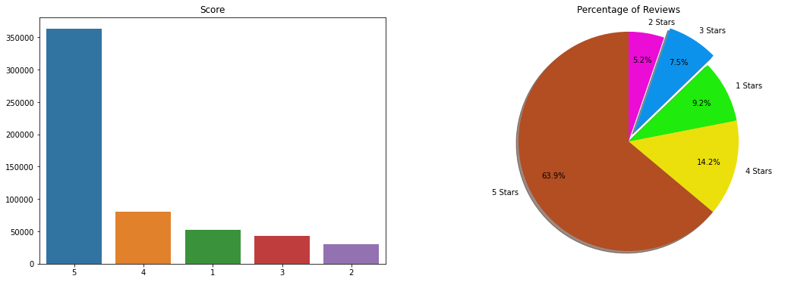
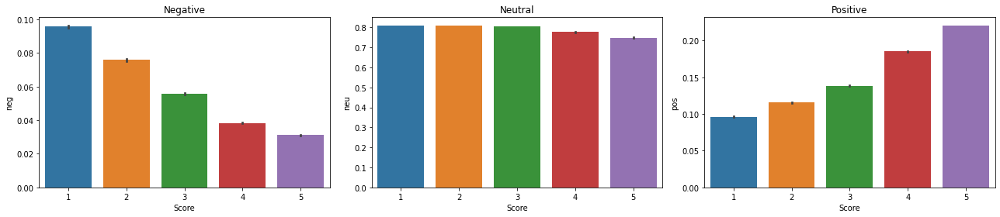
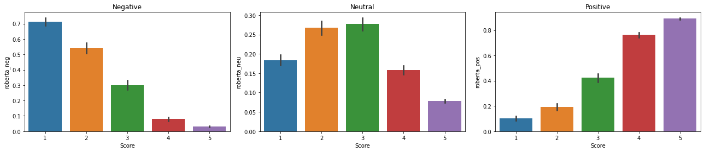
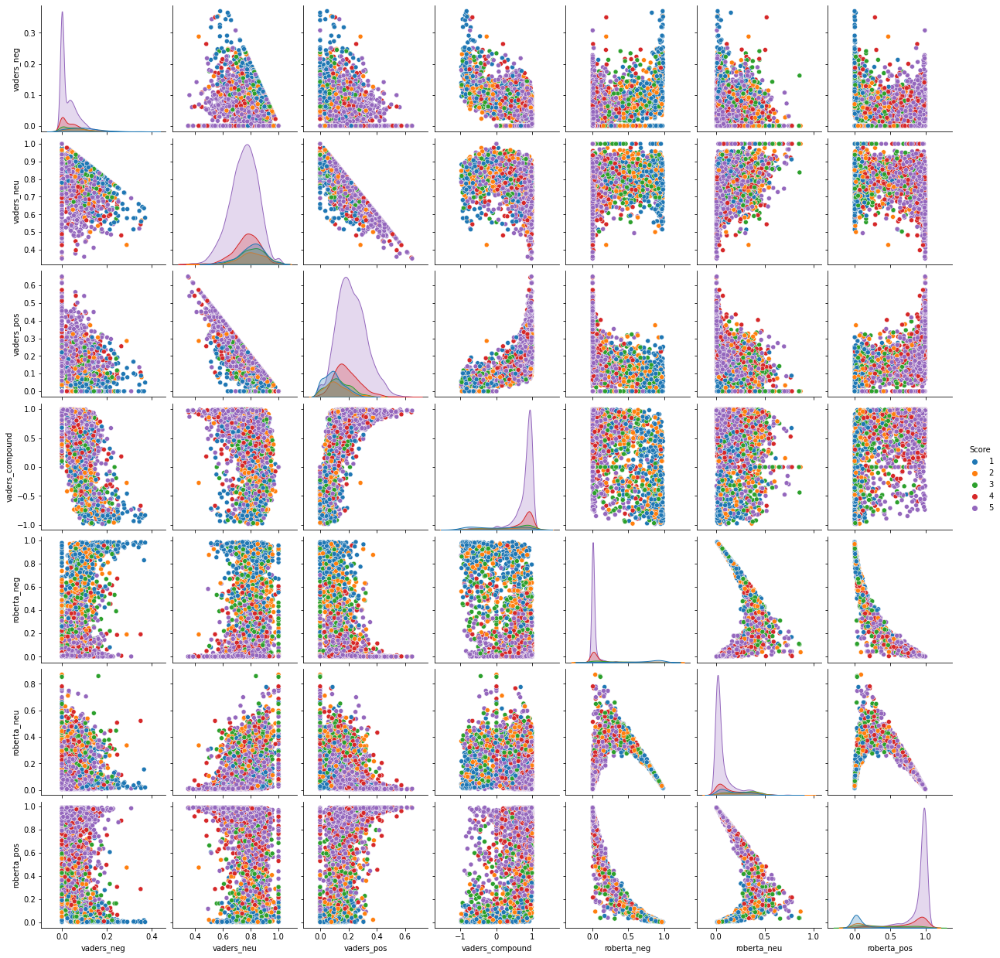

# Amazon Reviews Sentiment-Analysis
## Background Information : 
Amazon is one of the world's largest and most successful e-commerce companies, offering a wide range of products and services to customers around the globe. The company was founded in 1994 by Jeff Bezos and was originally an online bookstore. It quickly expanded to offer a wider variety of products, including electronics, home goods, apparel, and more. Today, Amazon operates globally, with a network of fulfillment centers and distribution centers that allow it to deliver products to customers around the world. In addition to its e-commerce business, Amazon also offers a range of other services, including cloud computing, advertising, and streaming media. The company is known for its innovative and customer-centric approach, and it has consistently ranked as one of the most valuable companies in the world.

## Objective:
In this project I've performed analysis on half a million Amazon Reviews and checked the sentiments of these reviews by implementing two NLTK (Natural Language Toolkit) models VADER and Roberta.

- ### Star Ratings and their Percentage

- ### VADER (Valence Aware Dictionary and sEntiment Reasoner) Results :
  VADER is a widely used tool in the field of natural language processing (NLP) for analyzing the sentiment of text data, such as tweets, comments, and reviews.

- ### RoBERTa Results : 
  RoBERTa (Robustly Optimized BERT) is a variant of the BERT (Bidirectional Encoder Representations from Transformers) language model that was developed by researchers     at Facebook AI.
  
  
  
- ### Comparing Both Models with a pair plot : 
  